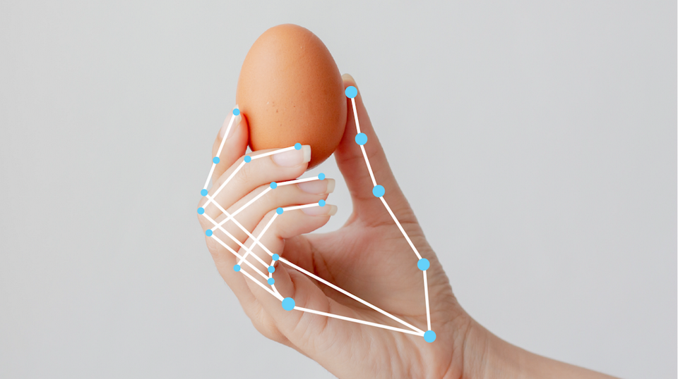
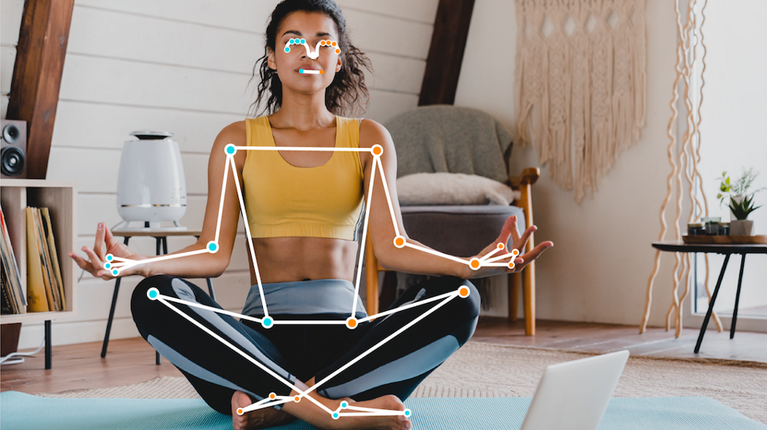
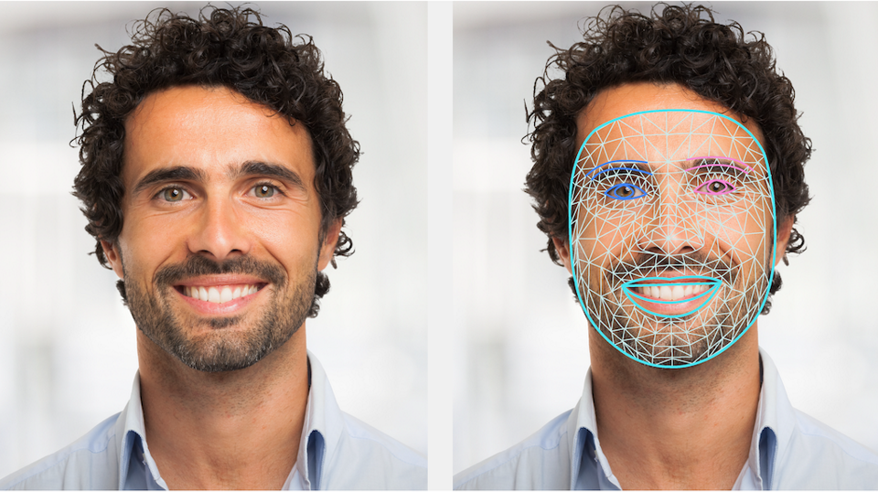
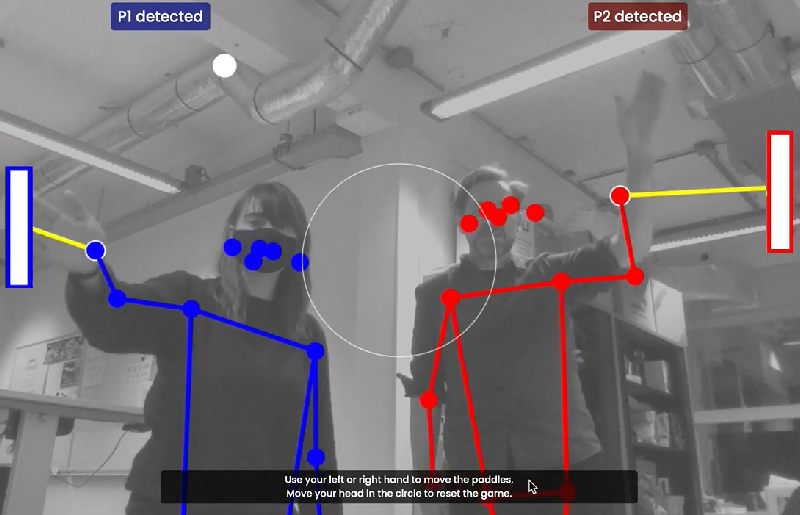
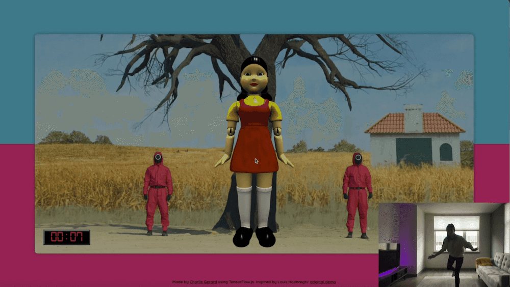
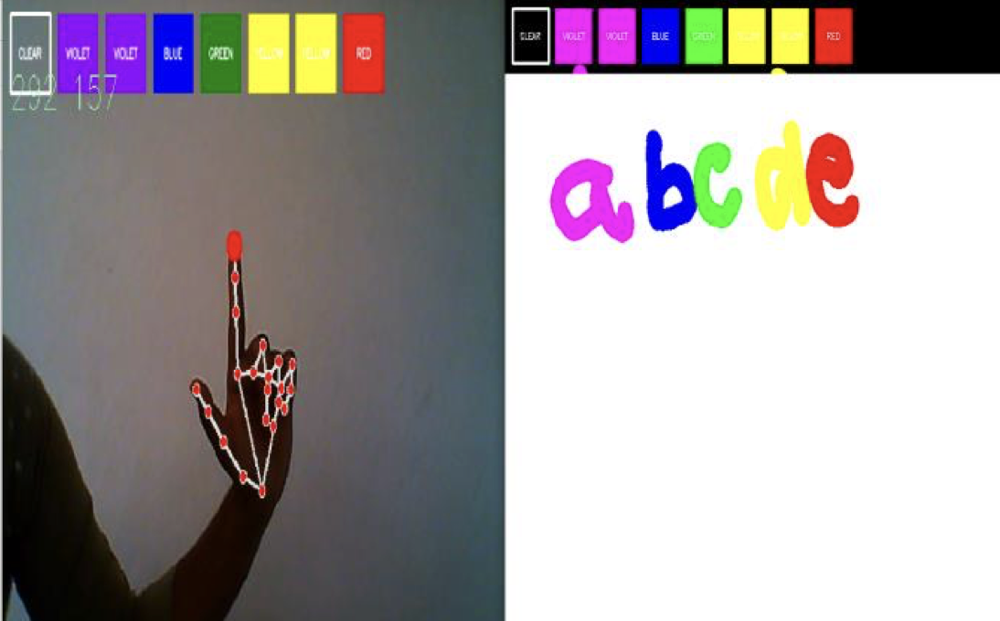
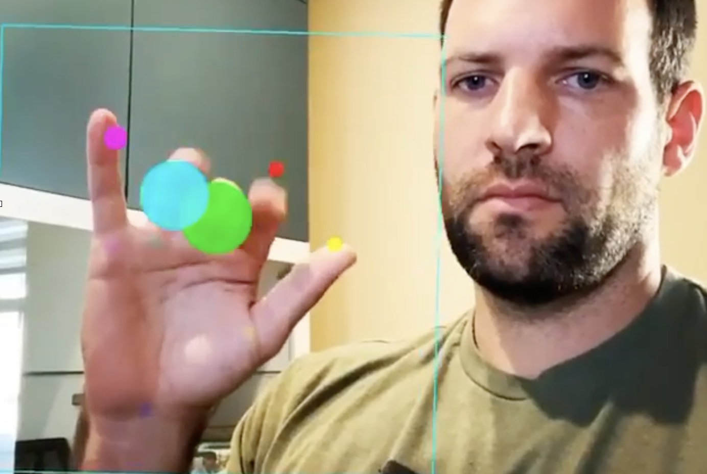

# Les 1 - Intl. week - Pose detection

## Pose Detection

- In les 1 en 2 gaan we met de webcam handgebaren leren herkennen in Javascript.
- Dit kan je toepassen in de TLE opdracht.


<br><br><br>

## MediaPipe

[MediaPipe](https://developers.google.com/mediapipe/solutions/examples) is een library van google, waarin een model is getraind om poses in webcam beelden te herkennen. 

| Hand | Body | Face |
| ---- | ---- | ---- |
|  |  |  |
| [Demo](https://codepen.io/eerk/pen/oNKVWvY?editors=0111) | [Demo](https://codepen.io/eerk/pen/QWPEYxj?editors=0011) | [Demo](https://mediapipe-studio.webapps.google.com/studio/demo/face_landmarker) |

<br><br><br>

## MediaPipe project

Je kan deze [boilerplate](./boilerplate/) code gebruiken om handposes te tekenen met de webcam.


<br><br><br>

## Posedata ophalen

MediaPipe geeft **per hand** een array terug van vector data. Dit bestaat uit een *`x,y,z` coördinaat* voor elk botje in je hand. 


De handen staan in `result.landmarks[0]` en `result.landmarks[1]`. Je kan dit in de console loggen. De detectie code moet je telkens herhalen met behulp van `requestAnimationFrame`. 

*voorbeeld*
```js
let result = handLandmarker.detectForVideo(video, performance.now());
if(result.landmarks) {
    console.log(result)
}
```


*resultaat*
```js
{
    handednesses: [],     
    worldlandmarks: [],   
    landmarks:[
        [{x:2, y:3, z:1}, {x:2, y:3, z:1}, {x:2, y:3, z:1}, ...],   // first hand
        [{x:2, y:3, z:1}, {x:2, y:3, z:1}, {x:2, y:3, z:1}, ...],   // second hand
    ]
}
```

<br><br><br>

## Posedata tekenen

In het code voorbeeld wordt de data uit [Hand Landmark Detection](https://mediapipe-studio.webapps.google.com/studio/demo/hand_landmarker) meteen in een canvas getekend, met behulp van [DrawingUtils](https://developers.google.com/mediapipe/api/solutions/js/tasks-vision.drawingutils). ⚠️ Dit kan je ook uitzetten.

*code voor tekenen*
```js
for (let i = 0; i < results.landmarks.length; i++) {
    let handmarks = results.landmarks[i]
    drawConnectors(canvasCtx, handmarks, HAND_CONNECTIONS, { color: "#03F600", lineWidth: 4 });
    drawLandmarks(canvasCtx, handmarks, { color: "#F40000", lineWidth: 3 })
}
```
<br><br><br>

# Coordinaten gebruiken

Je kan de landmarks data gebruiken voor je eigen creatieve toepassingen. In deze afbeelding zie je hoe de landmarks arrays zijn opgedeeld. De duim van hand `0` is dus: `result.landmarks[0][4]`. Hand `0` is de eerste hand die gedetecteerd is. Je kan in `results.handednesses[0]` zien of dit de linkerhand of rechterhand is.


<br>

🚨 Let op! de landmarks zijn getallen tussen de 0 en 1. De waarde `0,0` betekent linksboven. De waarde `1,1` betekent rechtsonder. Je moet deze waarden vermenigvuldigen met de breedte en hoogte van het video element. Als de duim bv. een `x,y` heeft van `0.2, 0.4` dan is de waarde in pixels `0.2 * videoWidth, 0.4 * videoHeight`.

```js
let image = document.querySelector("myimage")
let thumb = result.landmarks[0][4]
image.style.transform = `translate(${thumb.x * videoWidth}px, ${thumb.y * videoHeight}px)`
```


<br><br><br>

# Opdracht

Bedenk een toepassing waarbij de positie van de hand(en) gebruikt wordt. Denk bijvoorbeeld aan:

- Tekenprogramma
- Fruit Ninja (elementen weg slaan)
- Drumstel 
- Game karakter besturen

> *Let op dat een handpose ook een `z` coordinaat heeft (de afstand tot de camera)*


<br><br><br>

## Inspiratie

|  |  |
|--|--|
| <br>Handpositie gebruiken om pong paddles te besturen | <br>Afstand en beweging gebruiken om squid-game na te bouwen |
| <br>Wijsvinger gebruiken als verfkwast, duim als gum |<br>[Gestures gebruiken om drumcomputer te besturen](https://youtube.com/shorts/zQ8Il7xyVQk) | 


<br><br><br>


### Voorbeeldcode tekenprogramma

Je kan ook handmatig in het canvas element tekenen, dan heb je meer controle over wat je precies wil tekenen. Je kan hier ook kiezen om geen `clearRect()` te doen waardoor al je tekeningen over elkaar heen getekend worden. Je ziet hier een code voorbeeld voor het tekenen van een cirkel in het canvas element.

```js
let canvaselement = document.querySelector("canvas")
let canvasCtx = canvaselement.getContext("2d")
canvasCtx.fillStyle = "red"
canvasCtx.strokeStyle = "blue"
canvasCtx.lineWidth = 4

// teken 1 cirkel
let x = 0.2
let y = 0.5
canvasCtx.clearRect(0, 0, canvasElement.width, canvasElement.height); 
canvasCtx.beginPath()
canvasCtx.arc(canvasElement.width * x, canvasElement.height * y, 4, 0, 2 * Math.PI);
canvasCtx.stroke();
canvasCtx.fill()
```
> *TIP: Als je niet bekend bent met het `<canvas>` element kan je eerst [deze MDN tutorial volgen](https://developer.mozilla.org/en-US/docs/Web/API/Canvas_API/Tutorial)*

<br><br><br>


## Links

- [Hand Landmark Detection](https://mediapipe-studio.webapps.google.com/studio/demo/hand_landmarker)
- [DrawingUtils](https://developers.google.com/mediapipe/api/solutions/js/tasks-vision.drawingutils)
- [Canvas Drawing Tutorial](https://developer.mozilla.org/en-US/docs/Web/API/Canvas_API/Tutorial)
- [MediaPipe Guide](https://developers.google.com/mediapipe/solutions/guide)
- [MediaPipe Javascript Documentation](https://developers.google.com/mediapipe/api/solutions/js/tasks-vision)
- [MediaPipe Examples](https://developers.google.com/mediapipe/solutions/examples)
- [Codepen Hand](https://codepen.io/eerk/pen/oNKVWvY?editors=0111)
- [Codepen Body](https://codepen.io/eerk/pen/QWPEYxj?editors=0011)
- [Hand as computer interface](https://medium.spatialpixel.com/turning-your-hand-into-a-keyboard-6b21d092cfd0)
- [Charlie Gerard pose experiments](https://charliegerard.dev/projects)
- [MediaPipe in React](../snippets/react.md)
