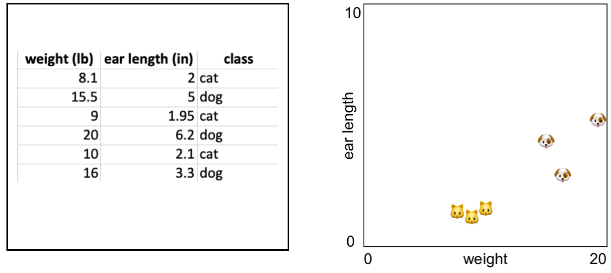

# Les 2 - Intl. week - Pose detection

In deze les gaan we leren hoe je specifieke handposes, zoals bijvoorbeeld 👊 📃 ✂️ kan herkennen! Daarmee kunnen we "rock, paper, scissors" gaan spelen.

- Werken met KNN in javascript
- Data verzamelen uit MediaPipe en opslaan als JSON.
- Data uit MediaPipe voorspellen met KNN


<br><br><br>

## Introductie K-Nearest-Neighbour

Dit algoritme kan sets van getallen met elkaar vergelijken om te zien welke het meest overeenkomen. We gaan dit gebruiken om handposes te vergelijken.

Een handpose heeft 63 punten (21 keer x, y, en z), maar het werkt ook met kleinere getallenreeksen.

In deze afbeelding zie je hoe KNN werkt. Door de getallenreeks `weight, ear length` als een `x,y` grafiek te tekenen kan je goed zien dat katten en honden in een eigen groepje zitten qua afstand.



Als we een nieuw punt tekenen in de grafiek, kunnen we via de **afstand tot de andere punten** bepalen of het nieuwe punt een kat of een hond is! Zie ook dit [interactief voorbeeld op Codepen](https://codepen.io/Qbrid/pen/OwpjLX). 

<br>
<br>
<Br>

## Oefenen met KNN

Download het bestand [knear.js](./knear.js) en voeg het toe aan jouw project. Maak een app.js aan:

```js
import kNear from "./knear.js"

const k = 3
const machine = new kNear(k);
```
<br><br><br>

## Katten en honden

Je gaat het KNN algoritme trainen met data. Je ziet dat data bestaat uit een array van getallen en een label.

```javascript
machine.learn([6, 5, 9, 4], 'cat')
machine.learn([12, 20, 19, 3], 'dog')
```
### Opdracht

Vul het voorbeeld aan met alle data uit onderstaande tabel.

| Body length | Height | Weight | Ear length |  Label |
| ----------- | ------ | ------ | ---------- |  ----- |
| 18 | 9.2 | 8.1 | 2 | 'cat' |
| 20.1 | 17 | 15.5 | 5 | 'dog' |
| 17 | 9.1 | 9 | 1.95 | 'cat' |
| 23.5 | 20 | 20 | 6.2 | 'dog' |
| 16 | 9.0 | 10 | 2.1 | 'cat' |
| 21 | 16.7 | 16 | 3.3 | 'dog' |

Als je met voldoende data getraind hebt, kan je een voorspelling doen. Dit betekent dat je van een onbekend dier gaat voorspellen of het een hond of een kat is.

```javascript
let prediction = machine.classify([12,18,17,12])
console.log(`I think this is a ${prediction}`)
```
<br>
<br>
<br>

# Handposes herkennen

Als je de basis van KNN onder de knie hebt, dan kan je deze kennis gaan gebruiken om handposes te herkennen.

Dit werkt eigenlijk precies hetzelfde, alleen moet je nu met handpose data gaan werken. Die data hadden we in les 1 al in de console gelogd:

```js
console.log(results.landmarks)
```
De uitdaging wordt nu om deze data om te zetten naar het formaat waar KNN mee kan werken.


<br><br><br>


# Opdracht

Maak een button die `console.log(results.landmarks[0])` uitvoert zodra je er op klikt. 

> *Let op dat er twee handen kunnen zijn, dit  zijn `results.landmarks[0]` en `results.landmarks[1]`.*

Een enkele pose bestaat uit een array van 20 punten, een `console.log` moet er als volgt uit gaan zien:
```js
[
     {x: 0.1, y: 0.3, z: 0.6},
     {x: 0.2, y: 0.7, z: 0.9},
     // ...in totaal 20 punten
]
```
De volgende stap is om dit console bericht te versimpelen. Kijk of je de `x,y,z` waarden van alle 20 punten achter elkaan in de console kan tonen. *Dit zijn dus 60 getallen.*. 

```js
[0.3.0.1.0.13.0.41.0.24.0.24,0.3...] // 60 getallen
```
> *Je kan de data omzetten met een `for` loop. [Bekijk ook de `map()` functie](https://developer.mozilla.org/en-US/docs/Web/JavaScript/Reference/Global_Objects/Array/map), en [de `flat()` functie](https://developer.mozilla.org/en-US/docs/Web/JavaScript/Reference/Global_Objects/Array/flat).*

<br><br><br>

### JSON file

Als het je gelukt is om een pose te tonen als simpele array, dan kan je een JSON file aanmaken waarin je jouw posedata gaat opslaan. De data van een pose kan je telkens handmatig copy>pasten uit de console naar je JSON file. 

Je moet per array een label opslaan, anders weet je niet wat voor pose bij de data hoort. Doe dit voor drie poses, waarbij je per pose 5 voorbeelden verzamelt. Je JSON file kan er dan zo uit gaan zien:

```js
[
    {points:[0.3.0.1.0.13.0.41.0.24.0,...], label:"rock"},
    {points:[0.3.0.1.0.13.0.41.0.24.0,...], label:"rock"},
    {points:[0.3.0.1.0.13.0.41.0.24.0,...], label:"rock"},
    // .. en nog meer poses voor paper en scissors
]
```

> *Bekijk [dit voorbeeld bestand](./data/data-rps.json) als je er niet uit komt.*


<br><br><br>

# Pose data gebruiken

Het omzetten van data was meer werk dan het tonen van poses uit de webcam! Dit is waarom het vak van AI ook wel Data Science heet...

Nu we posedata als json file hebben kunnen we dit leren aan KNN. Mocht je nog geen werkend JSON bestand hebben gebruik dan [dit voorbeeld bestand](./data/data-rps.json).

*json laden*
```js
fetch("mydata.json")
    .then(response => response.json())
    .then(data => train(data))
    .catch(error => console.log(error))
```
*data in knn*
```js
function train(poses) {
    for(let pose of poses) {
        // dubbel check of je hier een correct pose ziet:
        // {points:[2,4,5,3,...]}, "rock"}
        console.log(pose) 
        // geef de data aan de learn functie
        // machine.learn([2,4,5,3,...], "rock")
        machine.learn(pose.points, pose.label)
    }
}
```

## Poses herkennen

Als het trainen gelukt is kunnen we eindelijk testen of het hele proces goed is gegaan. 

Je kan met `classify` een van je bestaande poses invoeren, ***zonder het label*** om te kijken of KNN ziet welke pose dit is:

```js
function classifyPose(newpose) {
    let result = machine.classify(newpose)
}

classifyPose([2,3,4,5,6,7,...]) // een array uit je json file, zonder label
```

<br><br><br>

### Webcam poses herkennen

Als al het bovenstaande werkt kan je de `console.log()` code van je button aanpassen. De button gaat de array van getallen nu ook naar de `classifyPose()` functie sturen.


<br><br><br>

# Troubleshooting

- De labels kloppen niet of je bent labels vergeten.
- Niet elke handpose heeft 60 getallen, of je hebt getallen opgeslagen als strings. (bv. `pose="5,2,5,2"`)
- De data in je `machine.learn()` aanroep moet een array zijn, gevolgd door een label. Dit mag dus geen object zijn.
- De array in je `machine.classify()` aanroep moet óók precies 60 getallen bevatten.

#### Veel voorkomende fouten

```js
// fout
machine.learn({pose:[2,4,5,3,...], label:"rock"})
let result = machine.classify({pose:[2,4,5,3,...]})

// goed
machine.learn([2,4,5,3,...], "rock")
let result = machine.classify([2,4,5,3,...])
```

<br>
<br>
<br>

## Links

- [kNear](https://github.com/NathanEpstein/KNear)
- [KNN Codepen Demo](https://codepen.io/Qbrid/pen/OwpjLX) en [uitleg](https://burakkanber.com/blog/machine-learning-in-js-k-nearest-neighbor-part-1/)
- [MediaPipe Examples](https://developers.google.com/mediapipe/solutions/examples)
- [MediaPipe Javascript Documentation](https://developers.google.com/mediapipe/api/solutions/js/tasks-vision)
- [MediaPipe Handpose](https://developers.google.com/mediapipe/api/solutions/js/tasks-vision.handlandmarker#handlandmarker_class)
- [KNN in React](../snippets/reactknn.md) 
- [MediaPipe in React](../snippets/react.md) 
