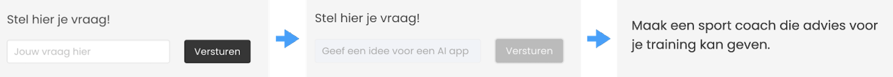

# Week 3

## Werken met Large Language Models

Deze week ga je je langchain kennis via [prompt engineering](https://platform.openai.com/docs/guides/prompt-engineering) uitbreiden om betere LLM calls te kunnen maken. Via externe API's ga je functionaliteit toevoegen aan je LLM applicatie. Let op dat je het concept voor jouw [opdracht 1](../opdracht1.md) op tijd inlevert. 

#### Onderwerpen

- Frontend
- Prompt engineering
- Temperature
- System instructions en chat roles
- Chat history
- Fake llm
- Koppeling met externe services
- Spraak
- Streaming
- Documentatie
- Andere LLM's en LLM api's

<Br><br><br>

## Frontend

Reminder week 2: De frontend (HTML pagina) communiceert met je node server. De user interface toont het resultaat. De frontend houdt bij wanneer de server nog bezig is met een OpenAI call, zodat je niet meerdere calls tegelijk opstart.



<Br><br><br>

## Prompt engineering

Dit houdt in dat je de vraag van de eindgebruiker uitbreidt met extra taalinstructies, om zo een beter resultaat terug te krijgen van het model. Bijvoorbeeld:

```js
let prompt = `Tell me how to take care of my banana plant`
let engineeredPrompt = `You are a plant expert. Answer the following question: ${prompt} as short as you can.`
let result = await model.invoke(engineeredPrompt)
```
Je kan de lengte van het antwoord bepalen met `maxTokens`. 

```js
const response = await model.invoke({
    prompt: "Can you ask me a question in German so I can practice?",
    max_tokens: 100 // Adjust as needed
});
```

- [Prompt Engineering](https://platform.openai.com/docs/guides/prompt-engineering)
- [Langchain Functies](https://js.langchain.com/docs/modules/model_io/prompts/quick_start) om prompt templates te schrijven.

#### Itereren

Werkt een prompt niet zoals je gehoopt had, lees hem dan nog eens goed en bedenk waarom de prompt verkeerd geïnterpreteerd zou kunnen worden. Je kan ook aan ChatGPT vragen om de prompt te verbeteren 🤯.

#### Technieken
* Geef de AI een rol die past bij wat je aan hem gaat vragen.
  *  ‘Je bent een zeer creatieve kinderboekenschrijver’
  *  ‘Je bent een extreem nauwkeurige wetenschapper gespecialiseerd in…’

* Wees duidelijk. Dat is bij taalmodellen niet hetzelfde als kort. Meer context is beter.

* Geef een voorbeeld van wat je verwacht.
  * ‘Een goede vraag voor deze dierenquiz zou zijn: hoeveel bulten heeft een kameel?’
  * ‘Als ik zeg dat de kat geen honger meer heeft, dan kan ‘kat eten geven’ uit de todo-lijst.

* Vraag om een output formaat zoals JSON, en geef daar ook een voorbeeld van.
  * Dit is zowel handig om het uit te kunnen lezen met een script, maar zorgt ook dat je kunt bepalen wat je allemaal in je antwoord wilt hebben.

* Formatteer zelf je antwoord om het model te helpen gegevens te vinden
  * ‘Geef een samenvatting van de tekst tussen <context></context>’.
  * ‘Het onderwerp voor het verhaal dat je moet verzinnen staat tussen [onderwerp][/onderwerp]’.


* Begeleid het ‘denkproces’ van het model
  * ‘De gebruiker wil graag een recept. Bedenk welke gerechten populair zijn in de Indische keuken die snel klaar zijn. De gebruiker heeft de volgende ingrediënten …. Kies een Indisch recept dat je daarmee zou kunnen maken in 30 minuten.’


<Br><br><br>

## Temperature

Als je aan het debuggen bent is het handig om voorspelbare resultaten te krijgen zodat je kunt zien of je prompt beter wordt. De onvoorspelbaarheid van een model regelen we met de `temperature`. Zet deze op 0.0 voor erg voorspelbare resultaten. 

Je kan dit juist een hoge waarde geven als je creatieve en onvoorspelbare resultaten wil krijgen. Een waarde van 1 is heel creatief. Als je boven de 1 gaat kan je vreemde of onlogische resultaten krijgen.

```javascript
const model = new ChatOpenAI({
    temperature: 0.0, 
    azureOpenAIApiKey: process.env.AZURE_OPENAI_KEY,
    //...etc
})
```
Je kan ook per prompt de temperature meegeven:

```js
const joke = await model.invoke({
      prompt: "Tell me a Javascript joke!",
      temperature: 2,
});
console.log(joke.content)
```


<br><br><br>

## System instructions en chat roles

Een chat model maakt onderscheid in de rol van degene die het bericht stuurt:

- `system` : Dit is een systeem instructie waarmee je kan aangeven hoe het chat model zich moet gedragen.
- `human` : Dit is het bericht van de eindgebruiker.
- `ai` (of `assistant`) : Hiermee kan je aangeven hoe het chat model zelf heeft gereageerd (of zou moeten reageren) op een vraag.

<br>

### Persoonlijkheid

Je assistent hoeft niet altijd netjes en behulpzaam te zijn. In dit voorbeeld sturen we een heel gesprek en system instructions naar het taalmodel, zodat het zal antwoorden in dezelfde toon:

```js
const res = await model.invoke([
    ["system", "You are a grumpy assistant who always answers with very few words. You end every sentence with complaining that the question was too easy."],
    ["human", "What is the solar system?"],
    ["assistant", "What a simple question! It's just the sun and a few planets!"],
    ["human", "What is the the biggest star in our solar system?"]
])
console.log(res.content)
```

Langchain biedt classes voor `HumanMessage`, `AIMessage` en `SystemMessage` zodat je hier minder snel typfouten in maakt:

```js
import { HumanMessage, SystemMessage, AIMessage } from "langchain/chat_models/messages"

const messages = [
  new SystemMessage("You're a helpful assistant"),
  new HumanMessage("What is the purpose of studying AI?"),
  new AIMessage("It will help you create smarter apps"),
  new HumanMessage("Does that mean I can let AI do all the work?"),
];

const result = await model.invoke(messages)
```

<Br><br><br>


## Chat history

De chat history is belangrijk omdat het taalmodel zelf niet onthoudt wat het eerder tegen je gezegd heeft. Zonder chat history kunnen vragen zoals `Wat bedoel je daarmee` niet goed beantwoord worden. Je moet dus bij elk nieuw chatbericht de hele chat history mee sturen. 

In dit code voorbeeld maken we een array met de history. Vragen van de gebruiker, en antwoorden van de chatbot worden met de juiste `role` toegevoegd.

```js
let messages = [
    ["system", "You are a neanderthal assistant. End every sentence with a different random grunt"],
    ["human", "How is the solar system composed?"],
]
const chat1 = await model.invoke(messages)
console.log(chat1.content)
```
Het antwoord van de ai voeg je toe aan de `messages` array met de juiste rol, gevolgd door een nieuwe vraag. Je geeft de hele array door aan het taalmodel.
```js
messages.push(
    ["ai", chat1.content],
    ["human", "Can you explain that a bit more?"]
)
const chat2 = await model.invoke(messages)
console.log(chat2.content)
```
#### Expert level: chat history in client

In bovenstaand voorbeeld is de chat history een variabele binnen de node applicatie. Maar als je tegelijk met meerdere web clients bent verbonden, krijgt niet elke user een eigen chat history.

- Hou de chat history bij *in de browser* in plaats van op de server, en geef die telkens mee. 
- Je hebt nu ook de optie om de chat history in `localStorage` op te slaan. Dan blijft de history zelfs bewaard nadat je de browser afsluit.

```js
messages.push(["human", "what do you mean by that?"])
localStorage.setItem("myChatHistory", JSON.stringify(messages))
```

<br><br><br>

### Fake LLM

Als je onderdelen van de app aan het testen bent waarvoor het chat result niet belangrijk is, is het beter om in `server.js` de [Langchain Fake LLM](https://js.langchain.com/docs/integrations/chat/fake) aan te roepen in plaats van OpenAI, omdat je dan tokens bespaart.

```js
import { FakeListChatModel } from "@langchain/core/utils/testing"

const chat = new FakeListChatModel({
    responses: ["Maybe later.", "Not right now"],
})

const res1 = await chat.invoke("Tell me a JavasSript joke!")
console.log(res.content)
```
[Documentatie Fake LLM](https://js.langchain.com/docs/integrations/chat/fake)


<Br><br><br>

## Koppeling met externe services

Het kan heel interessant zijn om externe services zoals Spotify, Openweather, News, etc. te koppelen aan een taalmodel. Je kan dan bijvoorbeeld de hele user interface in taal uitvoeren, of je kan het LLM laten klagen over het weer. 

*Pseudo code voorbeeld:*
```js
let weather = await fetch("http://api.openweathermap.org/forecast")
let temperature = weather.today.temp
let chatresult = model.invoke(`Complain about the temperature of ${temperature} degrees`)
```

- [Lijst van interessante API's om te koppelen aan je LLM](https://apilist.fun)
- [Koppel je Smart Home of Social Media aan een LLM](https://ifttt.com)

<Br><br><br>

## Onderzoek : andere LLM API's gebruiken

Met de [Langchain library](https://js.langchain.com/docs/integrations/platforms) kan je naast ***Azure OpenAI*** ook connectie maken met andere [LLM's](https://js.langchain.com/docs/integrations/llms/) en [ChatLLM's](https://js.langchain.com/docs/integrations/chat/). Voor de meeste van deze API's heb je een *API key nodig van de desbetreffende provider*. Je kan op eigen gelegenheid testen waar je een API key kan aanmaken. Populaire LLM API's zijn:

- [LLama API](https://www.llama-api.com)
- [Mistral](https://mistral.ai)
- [Anthropic Claude](https://docs.anthropic.com/claude/reference/getting-started-with-the-api)
- [Gemini](https://ai.google.dev)
- [Lokaal LLM](../snippets/local.md)

<br><br><br>

## 💬 Expert level: Spraak

De browser/javascript heeft zowel spraak als spraakherkenning ingebouwd.
De spraak komt uit je OS. In MacOS kan je [hier je eigen stem aan toevoegen!](https://support.apple.com/en-gb/guide/mac-help/mchldfd72333/mac). Je kan dit gebruiken om je LLM tot leven te brengen.

- [Code snippet spraak](https://github.com/HR-CMGT/PRG08-2023-2024/blob/main/snippets/speech.md)
- [Documentatie spraakherkenning](https://developer.mozilla.org/en-US/docs/Web/API/Web_Speech_API/Using_the_Web_Speech_API)

> *Je kan ook via [OpenAI "speech to text"](https://openai.com/research/whisper) doen, maar dit lijkt niet te werken met de Azure OpenAI key.*

<Br><br><br>

## Expert level: refining your code

Je kan deze onderwerpen gebruiken voor het expert level. In de [handleiding](https://js.langchain.com/docs/modules/model_io/llms/) vind je nog meer mogelijkheden.

- [Annuleren van een OpenAI call](https://js.langchain.com/docs/modules/model_io/llms/cancelling_requests)
- [Tokens bijhouden](https://js.langchain.com/docs/modules/model_io/llms/token_usage_tracking)
- [Omgaan met errors](https://js.langchain.com/docs/modules/model_io/llms/dealing_with_api_errors)


<Br><br><br>

## Expert level: streaming

Het kan tijd kosten voordat je een volledig antwoord van een LLM terug krijgt. Vooral bij hele lange antwoorden *(zoals de samenvatting van een boek)* kan het lijken of je user interface niet meer reageert. Om een betere user experience te creeëren kan je streaming gebruiken. Je krijgt dan woord-voor-woord een antwoord terug.

```js
const stream = await model.stream("Write an introduction for a book about a colony of tiny hamsters.")
for await (const chunk of stream) {
    console.log(chunk.content)
}
```
***Streaming in frontend*** : deze stream werkt in de `node` omgeving, maar nu moet je de response ook als stream terug sturen naar de browser. Dit kan met een [readablestream en fetch](https://www.loginradius.com/blog/engineering/guest-post/http-streaming-with-nodejs-and-fetch-api/).


<Br><br><br>

## Expert level: function calling

Een ***tool (of function)*** zorgt dat een LLM input kan leveren voor function calls. Een ***Agent*** is een LLM die de function dan ook daadwerkelijk uitvoert en zelf kijkt wat het resultaat is. 

- [Bekijk hier een compleet voorbeeld voor Langchain weerbericht function](../snippets/functions.md)
- [OpenAI LangChain Function Calling](https://js.langchain.com/docs/integrations/chat/openai)
- [OpenAI Agents in Langchain](https://js.langchain.com/docs/modules/agents/)


<br><br><bR>


## Documentatie

- [LangChain](https://js.langchain.com/docs/get_started/quickstart)
- [Langchain Azure OpenAI](https://js.langchain.com/docs/integrations/chat/azure)
- [Prompt Engineering](https://platform.openai.com/docs/guides/prompt-engineering)
- [Prompt Engineering for Developers - korte cursus](https://www.deeplearning.ai/short-courses/chatgpt-prompt-engineering-for-developers/) (In Python, maar omdat het om de prompts gaat maakt dat niet uit)

In de lessen benaderen we Azure OpenAI via LangChain. Je kan hier meer lezen over Azure en OpenAI.

- [Eigen OpenAI key aanvragen](https://platform.openai.com/docs/introduction)
- [OpenAI API](https://platform.openai.com/docs/introduction)
- [Azure REST API](https://learn.microsoft.com/en-gb/azure/ai-services/openai/reference)


