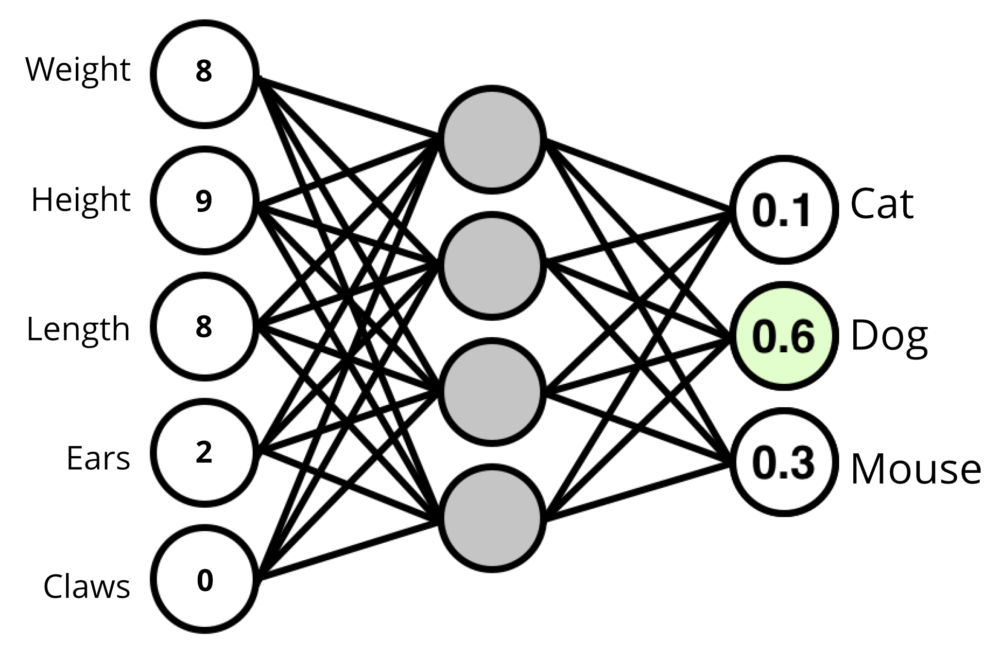
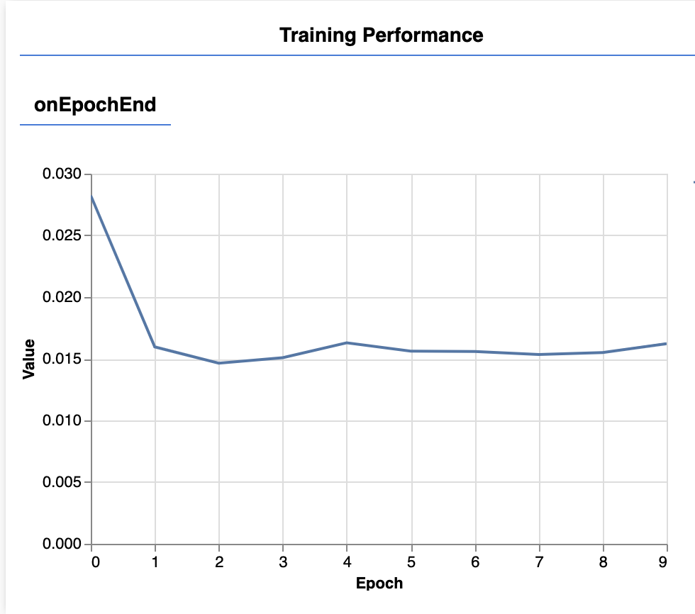
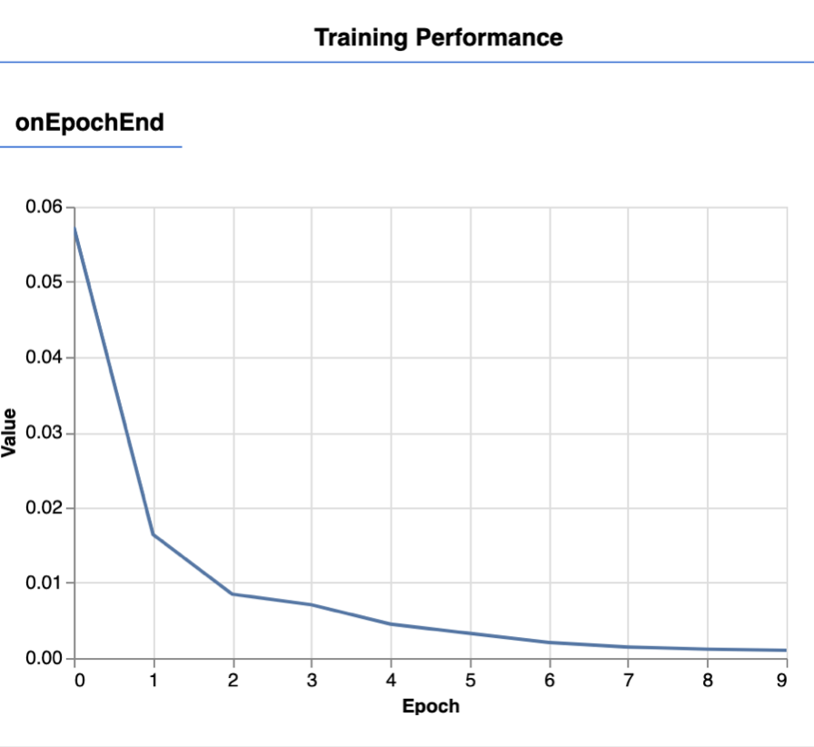

# Les 4

- Werken met Neural Networks in Javascript
- Data, trainen en model opslaan
- Voorspellingen doen
- Expert level
- Troubleshooting

<br><br><br>

## Neural Networks



<br>

Eerder hebben we pose data leren herkennen met het "K-Nearest-Neighbour" algoritme. We gaan nu het "Neural Network" algoritme gebruiken. Een aantal voordelen:

- Het KNN model moet altijd alle data onthouden. 
- Een KNN model kan erg groot zijn als er veel data is.
- Het NN model kan juist erg klein zijn, ongeacht hoeveel data er is.
- Een NN is beter in het vinden van complexe of onlogisch lijkende patronen *(een grote dikke kat wordt toch als kat herkend en niet als hond)*
- Een NN kan focussen op de belangrijke onderdelen *(de "claws" van een kat bepalen eigenlijk al dat het een kat is)*

<br>
<br>
<br>

# Neural Network: the basics

Om te oefenen gebruiken we dezelfde cat/dog data als in week 6.

| Body length | Height | Weight | Ear length |  Label |
| ----------- | ------ | ------ | ---------- |  ----- |
| 18 | 9.2 | 8.1 | 2 | 'cat' |
| 20.1 | 17 | 15.5 | 5 | 'dog' |
| 17 | 9.1 | 9 | 1.95 | 'cat' |
| 23.5 | 20 | 20 | 6.2 | 'dog' |
| 16 | 9.0 | 10 | 2.1 | 'cat' |
| 21 | 16.7 | 16 | 3.3 | 'dog' |

We voegen de [ML5](https://learn.ml5js.org/#/reference/neural-network) library toe aan ons project met een `<script>` tag.

```html
<script src="https://unpkg.com/ml5@1/dist/ml5.min.js"></script>
```
Maak het ML5 neural network aan. Je kan hier `cpu` instellen als WebGL niet werkt op jouw machine.
```js
ml5.setBackend("webgl");
const nn = ml5.neuralNetwork({ task: 'classification', debug: true })
```
Voeg de cat/dog data toe. Vul dit zelf helemaal in.
```js
nn.addData([18,9.2,8.1,2], {label:"cat"})
nn.addData([20.1,17,15.5,5], {label:"dog"})
// vul hier zelf de rest van de data in
// ...
```
Nu kan je het netwerk trainen op je data:
```js
nn.normalizeData()
nn.train({ epochs: 10 }, () => finishedTraining()) 
async function finishedTraining(){    
    const results = await nn.classify([29,11,10,3])
    console.log(results)
}
```
Zorg dat je cats and dogs kan voorspellen voordat je verder gaat met de mediapipe oefening.

> *In bovenstaande code wordt zowel een `callback` als een `async await` code gebruikt. Je moet wachten tot het trainen klaar is, en je moet ook wachten tot een `classify` klaar is. Vergeet dit niet bij het bouwen van je eigen app*.

<br>
<br>
<br>

# Workflow

We gaan nu werken aan opdracht 2. Je gaat posedata gebruiken om een neural network te trainen. Je werkt in drie projecten:

| Voorbereiding | Training | Applicatie | 
| ----------- | ------ | ------ | 
| Data verzamelen uit MediaPipe | Data gereed maken | Webcam stream lezen |
| Opslaan in JSON of JS file | Neural Network trainen | Model laden |
|  | Model opslaan | Voorspelling doen | 

<br><br><br>

# Werken met posedata

Zorg dat je posedata beschikbaar is in je project. Data kan in de vorm van objecten of arrays zijn. Voor een neural network is het belangrijk om je *data te randomizen*. 

```js
let data = [
    {pose:[4,2,5,2,1,...], label:"rock"},
    {pose:[3,1,4,4,1,...], label:"rock"},
    {pose:[5,2,5,3,3,...], label:"paper"},
    ...
]
data = data.toSorted(() => (Math.random() - 0.5))
```
<br><br><br>

## Data gereed maken voor Neural network

Na het randomizen kan je poses aan het neural network toevoegen via de `addData` functie. Dit doe je door je data op te splitsen in een array van numbers: `[3,5,2,1,4,3,5,2]`, gevolgd door een object met het label: `{label:"rock"}`. Je voegt één pose als volgt toe:
```js
nn.addData([3,5,2,1,4,3,5,2], {label:"rock"})
```
Je hebt een `for` loop nodig om één voor één al je pose data toe te voegen. 

> *🚨 Een veel voorkomende fout is dat je posedata uit mediapipe niet naar de juiste vorm is omgezet voor de `addData` functie. Wat ook vaak fout gaat is dat niet **elke pose** evenveel punten bevat, of dat je labels niet overeenkomen.*

<br><br><br>

## Trainen

Nadat je al je data hebt toegevoegd roep je de `normalize` functie aan. Daarna begin je met trainen. Bij het trainen kan je experimenteren met het aantal `epochs`. De blauwe lijn moet zo dicht mogelijk bij de waarde 0 komen. 

> *Als de blauwe lijn nauwelijks verbetert, ook bij een hoog aantal epochs, dan is er waarschijnlijk een probleem met je data. Zie het `troubleshooting` hoofdstuk*.

```javascript
function startTraining() {
    nn.normalizeData()
    nn.train({ epochs: 10 }, () => finishedTraining()) 
}
async function finishedTraining(){
    console.log("Finished training!")
}
```

| Training kan beter | Training gaat goed | 
| ----------- | ------ | 
|  |  | 


<br>
<br>
<br>

## Maak een voorspelling

Als je een model hebt, kan je met de `classify` functie testen of je nieuwe data kan voorspellen. Neem bijvoorbeeld handmatig een pose uit je data, of uit mediapipe, en kijk of dit ook goed voorspeld wordt. Let op dat je posedata evenveel punten bevat als bij het trainen!

```js
async function makePrediction() {
    const results = await nn.classify([2,4,2,1,3,5,6]) // dit is een pose uit mediapipe
    console.log(results)
}
```

<br>
<br>
<br>

## Model opslaan

Omdat je niet telkens opnieuw een model wil trainen gaan we het opslaan.

```js
nn.save("model", () => console.log("model was saved!"))
```
<br>
<br>
<br>

# De frontend applicatie bouwen

Dit is je game of applicatie die door de eindgebruiker gebruikt gaat worden. Hierin wordt de live webcam getoond met poses. Je gaat nu ook weer posedata uit de webcam halen. Het doel is nu om te voorspellen welke pose de gebruiker aanneemt, dit doen we met ons getrainde model.

- Toon de webcam en lees posedata met mediapipe
- Laad het getrainde model
- Maak een voorspelling van de live posedata

<br><br><br>

## Model laden

```js
ml5.setBackend("webgl");
const nn = ml5.neuralNetwork({ task: 'classification', debug: true })
const modelDetails = {
    model: 'model/model.json',
    metadata: 'model/model_meta.json',
    weights: 'model/model.weights.bin'
}
nn.load(modelDetails, () => console.log("het model is geladen!"))
```
Nadat het model is geladen *(let op de callback functie)*, kan je live posedata uit de webcam gaan voorspellen met het neural network. Verzamel data van één live pose, en roep hiermee de `classify()` functie aan.

<br>
<br>
<br>

# Expert level

- Je kan zelf extra [hidden layers](../snippets/layers.md) toevoegen om complexere data te kunnen leren.
- Je kan [React](../snippets/react.md) gebruiken om de MediaPipe data te verzamelen.
- Je kan het [ML5 Neural Network in React](../snippets/reactml5.md) gebruiken om voorspellingen in de UI te tonen.

<br>
<br>
<br>

# Troubleshooting

### Workflow

Bij het werken met Neural Networks heb je vaak meerdere projecten tegelijk open staan:

- Het project waarin je data verzamelt uit de webcam en er een label aan geeft. 
- Het project waarin je een model aan het trainen bent met de gelabelde data. Hier heb je de webcam input niet nodig.
- Het project waarin je test of je model goed werkt met nieuwe input. Dit kan je doen met testdata of met live webcam input. In het eindproduct hoef je niet altijd de pose als lijntjes over het webcam beeld heen te tekenen.

<br>

### Asynchrone functies en callbacks

Een ML5 neural network werkt met [callbacks en asynchrone functies](https://learn.ml5js.org/#/tutorials/promises-and-callbacks). Dat betekent dat je moet *wachten* totdat een bepaalde taak is afgrond, *voordat* je de volgende taak kan uitvoeren! Bijvoorbeeld:

- Laden van een JSON file met `fetch`
- Trainen van een ML5 Neural Network
- Inladen van een model
- Doen van een voorspelling

Je moet wachten totdat een call klaar is voordat je naar de volgende stap door kan gaan. In dit codevoorbeeld wachten we tot het laden van het model klaar is:

```js
nn.load(modelDetails, () => nextStep())

function nextStep(){
    console.log("het model is geladen!")
}
```

> *🚨Een veel voorkomende fout is om te proberen een voorspelling te doen terwijl het trainen nog niet klaar is, of als het model nog niet is ingeladen.*

<br>

### Fouten bij trainen

Het trainen van een model kan makkelijk mis gaan. De meest voorkomende oorzaken:

- De data is niet consistent. De inhoud van elk datapunt *(een array met getallen)* moet hetzelfde zijn (bv. een array van 20 numbers).
- Er is te weinig data. Probeer minimaal 20 tot 30 poses per label op te slaan. 100 poses zou nog beter zijn.
- De data bevat niet genoeg variatie. Dit valt op als het trainen wel goed gaat maar het voorspellen werkt niet goed. Probeer voor elk label verschillende variaties op te slaan *(dichtbij camera, ver van camera, links in beeld, rechts in beeld)*.
- De labels kloppen niet of je bent labels vergeten.
- Er is iets mis gegaan bij het omzetten van je webcam data naar training data. Je moet een array van getallen en een object met een label doorgeven `[3,3,4,32,2], {label:"Rock"}`.
- De labels komen niet overeen (bv. `"Rock"` en `"rock"` is niet hetzelfde).
- Je data in de `classify` aanroep heeft een andere vorm dan de data die je bij `addData` hebt gebruikt.

#### 🚫 De pose is hier een object, maar het moet alleen een array met numbers zijn

```js
nn.addData({pose:[2,4,5,3]}, {label:"rock"})
```
#### 🚫 De classify aanroep is niet hetzelfde als de addData aanroep
```js
nn.addData([2,3,4], {label:"rock"})
nn.addData([5,3,1], {label:"paper"})
let result = await nn.classify([2,3,4,5,6,7])
```
#### ✅ Data toevoegen mag wel in verschillende formaten:
```js
nn.addData([2,3,4], ["rock"])
nn.addData([5,3,1], ["paper"])
let result = await nn.classify([2,3,1])
```
```js
nn.addData({r:200, g:10, b: 10}, {label:"red"})
nn.addData({r:20, g:200, b: 10}, {label:"green"})
let result = await nn.classify({r:18: g:180, b:5})
```

<br>
<br>
<br>

## Documentatie

- [ML5 AI library voor Javascript](https://docs.ml5js.org/#/)
- [ML5 Neural Networks](https://docs.ml5js.org/#/reference/neural-network)
- [ML5 Neural Networks Hidden Layers](../snippets/layers.md)
- [MediaPipe in React](../snippets/react.md) 
- [ML5 Neural Network in React](../snippets/reactml5.md) 
- [📺 Crash Course Neural Networks](https://www.youtube.com/watch?v=JBlm4wnjNMY)
- [📺 But what is a neural network?](https://www.youtube.com/watch?v=aircAruvnKk)
