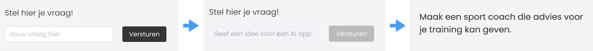

# Les 6 - deel 2

## Webproject opzetten

- We gaan de OpenAI aanroep in een `express` server plaatsen.
- We gaan een frontend toevoegen waarin de eindgebruiker een vraag kan stellen.




<br><br><br>

## Express toevoegen

In PRG06 heb je geleerd te werken met node express. Installeer het als volgt:

```sh
npm install express
npm install cors
```
Om te oefenen maken we een `get` request die `hello world` terug geeft in JSON formaat:

```js
import express from 'express'
import cors from 'cors'

const app = express()
app.use(cors())

app.get('/', (req, res) => {
  res.json({ message: 'Hello, world!' })
})

app.listen(3000, () => console.log(`Server running on http://localhost:3000`))
```

Start de server! Gebruik `--watch` voor auto restart.

```sh
node --env-file=.env --watch server.js
```

Roep de server aan in je adresbalk van je browser (http://localhost:3000) of via [Postman](https://www.postman.com), [Hoppscotch](https://hoppscotch.io) of [Thunder Client](https://www.thunderclient.com). Als het goed is krijg je `hello world` terug als JSON.

<br><br><br>

## OpenAI aanroep integreren

In plaats van `hello world` gaan we nu een javascript joke terug sturen, die is gegenereerd door OpenAI. Je kan dit doen door je eigen `tellJoke()` functie vanuit express aan te roepen:

```js
import express from 'express'
import cors from 'cors'
import { AzureChatOpenAI } from "@langchain/openai";

const model = new AzureChatOpenAI({ temperature: 1 });

const app = express()
app.use(cors())

app.get('/', async (req, res) => {
  const result = await tellJoke()
  res.json({ message: result })
})

async function tellJoke() {
    const joke = await model.invoke("Tell me a Javascript joke!")
    return joke.content
}

app.listen(3000, () => console.log(`Server running on http://localhost:3000`))
```
Test of je nu via http://localhost:3000 een javascript joke terug krijgt!

<br><br><br>

## POST request

Omdat we straks vanuit de frontend een formulier gaan versturen moeten we een `post` request toevoegen aan `server.js`. Het `get` request laten we staan omdat het handig is om mee te testen.

```js
const app = express()
app.use(cors())
app.use(express.json());
app.use(express.urlencoded({extended: true}));


app.get(...)

app.post('/', async (req, res) => {
    let prompt = req.body.prompt
    console.log("the user asked for " + prompt)
    res.json({ message: 'Hello, world!' })
})

app.listen(3000, () => console.log(`app luistert naar port 3000!`))
```
Dit kan je testen via [Postman](https://www.postman.com), [Hoppscotch](https://hoppscotch.io) of [Thunder Client](https://www.thunderclient.com). 

<br><br><br>

# Frontend

Voeg een `Client` map toe waarin je je frontend gaat bouwen:


```
SERVER
├── .env
├── .gitignore
├── package.json
├── node_modules
├── server.js
CLIENT
├── index.html
├── script.js
└── style.css
```

- Maak je `index.html`, `style.css` en `app.js` files aan in de `client` map.
- Je hoeft hier geen `npm install` te doen omdat we niet met libraries werken.
- Open dit als apart project in je code editor. Je kan een [live server](https://marketplace.visualstudio.com/items?itemName=ritwickdey.LiveServer) starten voor `index.html`.

<br><br><br>

## Werken met Fetch

Om te oefenen gaan we het `get` request op de server aanroepen met `fetch` vanuit `app.js`. Het `get` request stuurt `hello world` of een javascript joke terug. 

```js
async function askQuestion() {
    const response = await fetch("http://localhost:3000/") 
    if(response.ok){
        const data = await response.json()
        console.log(data)
    } else {
        console.error(response.status)
    }
}
askQuestion()
```
#### Oefening

Toon het resultaat in de HTML pagina in plaats van in de console.

<br><br><br>

### Formulier maken

Het is de bedoeling dat de gebruiker een vraag kan sturen naar je server. Dit gaan we doen met een POST request.

- Maak een invulformulier met button in de `html` file met een submit button.
- On submit roep je je fetch function aan. Let op dat je de default submit actie annuleert.

```html
<form>
    <input type="text" placeholder="je vraag hier" id="chatfield">
    <button type="submit">
</form>
```
```js
const form = document.querySelector("form")
form.addEventListener("submit", (e) => askQuestion(e))

function askQuestion(e){
    e.preventDefault()
}
```

#### POST request sturen

We gaan de `fetch` functie uitbreiden met een `POST` request waarmee de waarde uit het invulveld wordt verstuurd.

```js
async function askQuestion(e) {
    e.preventDefault()

    const options = {
        method: 'POST',
        mode:'cors',
        headers: {
            'Content-Type': 'application/json'
        },
        body: JSON.stringify({ prompt: chatfield.value })
    }

    const response = await fetch("http://localhost:3000/", options) 
    if(response.ok){
        const data = await response.json()
        console.log(data)
    } else {
        console.error(response.status)
    }
}
```

<br><br><br>


# Applicatie af maken

Als het goed is kan je nu formulierdata naar je `node` server sturen. De node server genereert vervolgens een response via OpenAI en stuurt dit weer terug naar je client. Je kan nog de volgende stappen doorlopen om de applicatie helemaal af te maken:

- Zorg dat de vraag die de gebruiker in het invoerveld stelt, ook echt naar OpenAI wordt gestuurd. Dit is dus in plaats van de prompt `tell me a javascript joke`.
- Zorg dat je submit button disabled is zo lang er nog geen antwoord terug is gekomen. 
- Het resultaat toon je vervolgens weer aan de gebruiker in de user interface. Enable de submit button.


<br><Br><br>

## Links

- [Node Express Hello World](https://expressjs.com/en/starter/hello-world.html)
- [JSON teruggeven vanuit Express](https://expressjs.com/en/5x/api.html#res.json)
- [Voorbeeld fetch met POST](https://jasonwatmore.com/post/2021/09/05/fetch-http-post-request-examples)
