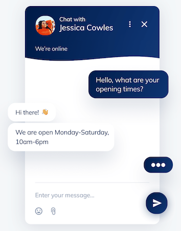

# Les 8

## Vragen stellen over documenten.

Een chatbot kan praten met bezoekers van je website. Het kan erg handig zijn als de chatbot dan ook specifieke vragen over jouw product of service kan beantwoorden. Denk aan een camera shop waarbij de chatbot alles weet over de camera's die in jouw shop staan. Om dat te bereiken kan je als webdeveloper vantevoren de data over jouw service beschikbaar maken voor het taalmodel. 

Een manier om dat te bereiken is om data over jouw shop/service klaar te zetten voor gebruik door een taalmodel. Dit heet ***RAG***: *Retrieval Augmented Generation*.



#### Voorbereiding

- Tekstbestand inlezen
- Tekst omzetten naar vectordata
- Vectordata opslaan
- Let op privacy en copyright

#### Webserver

- Vectordata inlezen
- Zoeken in vectordata naar relevante tekst voor de vraag van de gebruiker
- OpenAI API gebruiken om hier een netjes antwoord van te maken

<br>

[🚀 Bekijk deze uitleg om te zien waarom we tekst omzetten naar vectordata](https://ig.ft.com/generative-ai/)

<br><br><br>

# Voorbereiding

De voorbereiding doe je in een apart project of `.js` file.

## Werken met vectordata

Installeer de benodigde packages:
```sh
npm install @langchain/openai @langchain/community @langchain/core @langchain/textsplitter faiss-node
```

Taalmodellen werken met `vectordata` om verbanden tussen teksten te kunnen leggen. Jouw tekst moet je dus omzetten naar vectordata. Dit noemen we `embedding`. Om tekst te `embedden` heb je een taalmodel nodig dat *geen* volledig chat model is. OpenAI gebruikt hier het `ada` model voor:

```js
import { AzureChatOpenAI, AzureOpenAIEmbeddings } from "@langchain/openai";
import { MemoryVectorStore } from "langchain/vectorstores/memory";

const model = new AzureChatOpenAI({temperature: 1});

const embeddings = new AzureOpenAIEmbeddings({
    temperature: 0,
    azureOpenAIApiEmbeddingsDeploymentName: process.env.AZURE_EMBEDDING_DEPLOYMENT_NAME
});
```
#### "Hello world" omzetten naar vectoren

```js
const vectordata = await embeddings.embedQuery("Hello world")
console.log(vectordata)
console.log(`Created vector with ${vectordata.length} values.`)
```
[Langchain documentatie voor Azure OpenAI embedding](https://js.langchain.com/docs/integrations/text_embedding/).

<br><br><Br>

## Tekstbestand inlezen

Langchain heeft verschillende opties om tekstbestanden te lezen, zoals [.txt, PDF, JSON, CSV, etc.](https://js.langchain.com/docs/modules/data_connection/document_loaders/). Je kan zelfs een [hele github repository](https://js.langchain.com/docs/integrations/document_loaders/web_loaders/github#usage) inlezen. In dit voorbeeld lezen we een `.txt` file. De ingelezen tekst 'knip' je op in chunks. Doordat de chuncks een vaste grootte hebben kan het gebeuren dat je midden in een zin/passage knipt. Om te voorkomen dat je chunks met halve informatie krijgt geef je de chunks een overlap. 

```js
import { TextLoader } from "langchain/document_loaders/fs/text";
import { RecursiveCharacterTextSplitter } from "langchain/text_splitter";
import { MemoryVectorStore } from "langchain/vectorstores/memory";

let vectorStore

async function createVectorstore() {
    const loader = new TextLoader("./public/example.txt");
    const docs = await loader.load();
    const textSplitter = new RecursiveCharacterTextSplitter({ chunkSize: 1000, chunkOverlap: 200 });
    const splitDocs = await textSplitter.splitDocuments(docs);
    console.log(`Document split into ${splitDocs.length} chunks. Now saving into vector store`);
    vectorStore = await MemoryVectorStore.fromDocuments(splitDocs, embeddings);
}
```
<br><br><br>

## Test: vragen stellen

Om te zien of het omzetten naar vectoren is gelukt gaan we als test een vraag stellen:

- Je geeft een prompt.
- Langchain zoekt in je vectorstore naar tekst die daar het beste bij past.
- Het prompt en het zoekresultaat worden naar OpenAI gestuurd om er een mooi antwoord van te maken.

```js
async function askQuestion(){
    const relevantDocs = await vectorStore.similaritySearch("What is this document about?",3);
    const context = relevantDocs.map(doc => doc.pageContent).join("\n\n");
    const response = await model.invoke([
        ["system", "Use the following context to answer the user's question. Only use information from the context."],
        ["user", `Context: ${context}\n\nQuestion: What is this document about?`]
    ]);
    console.log("\nAnswer found:");
    console.log(response.content);
}
```

<br><br><br>

## Vectorstores

De `MemoryVectorStore` blijft niet bewaard tussen sessies. Daardoor moet je de embeddings telkens opnieuw maken, dat kost tijd en tokens. Om dat te voorkomen kan je de embeddings opslaan in een vectorstore:

- *Lokaal bestand*. De vectordata wordt als lokaal bestand binnen je project opgeslagen, wij werken met FAISS.
- *Vector database*. Dit is een "echte" database op je systeem, zoals ChromaDB, MongoDB.
- *Cloud database*. Je vectordata staat in de cloud, waardoor het vanuit meerdere projecten online toegankelijk is. Sommige cloud services, zoals [pinecone](https://www.pinecone.io) bieden 1 gratis online vectorstore.


#### Vectordata opslaan
```js
import { FaissStore } from "@langchain/community/vectorstores/faiss";

vectorStore = await FaissStore.fromDocuments(splitDocs, embeddings);
await vectorStore.save("vectordatabase"); // geef hier de naam van de directory waar je de data gaat opslaan
```

> ⚠️ ***Let op dat je de data maar 1x hoeft op te slaan.*** Om die reden is het handiger om met twee losse `.js` files te werken. Een voor het maken van vectordata, en een voor het inlezen en vragen stellen.

<br><br><br>

## Privacy en copyright

Bij het maken van embeddings verstuur je een document naar OpenAI en/of Microsoft. Het is daarom belangrijk dat je geen data verstuurt die auteursrechtelijk beschermd is. Om data helemaal veilig te houden zou je kunnen werken met een [Lokaal LLM of je eigen LLM hosting](../snippets/local.md)

<br><br><br>

# Web server

In je `server.js` file kan je nu code toevoegen om vragen over de tekst te kunnen stellen:

### Vectordata inlezen
```js
import { FaissStore } from "@langchain/community/vectorstores/faiss";

vectorStore = await FaissStore.load("vectordatabase", embeddings); // dezelfde naam van de directory 
```

<br><br><br>

### Vragen stellen

Je kan bovenstaande code voor `askQuestion()` gebruiken in je `server.js`. Je kan er ook voor kiezen om de chat history bij te houden, door vragen en antwoorden telkens in de array te pushen.

```js
let history = [
    ["system", "Use the following context to answer the user's question. Only use information from the context."],
    ["user", `Context: ${context}\n\nQuestion: What is this document about?`]
]
const response = await model.invoke(history);
// antwoord toevoegen aan chat history
history.push(["ai", response.content])
```

<br><br><br>


## CAG en context window

De reden dat we RAG gebruiken is dat veel taalmodellen nog een klein *context window* hebben. Dit is de hoeveelheid data die het model tegelijkertijd in het geheugen kan houden, en dus iets over kan zeggen. Hieronder een overzicht van context windows voor verschillende taalmodellen.

| Model	| Context Window (tokens)	| Words |
|-------|---------------------------|-------|
| ChatGPT‑3.5  | ~4.096 | ~6.150 |
| LLaMA 2  |	~4.096| ~6.150 |
| GPT‑4o|	~128.000 |	~192.000 |
| Anthropic Claude 3 | ~200,000 |  ~150.000 |
| Google Gemini 2.5 | up to ~1.000.000 | ~1.500.000	|

Omdat het context window van nieuwe modellen heel groot is, is het soms handiger om gewoon je hele document mee te sturen in het eerste gebruikersprompt. Dit geldt ook als je document eigenlijk maar heel klein is. Het meesturen van het hele document noemen we ***CAG*** (Cache Augmented Generation). Dit is sneller dan het eerst opslaan van je data in een vectordatabase, om vervolgens in die vectordatabase te zoeken naar het juiste antwoord.

Ter vergelijking: één A4'tje bevat ongeveer 500 woorden, *The Lord of the Rings* bevat ongeveer 480.000 woorden.

<br><br><br>


## Tips en troubleshooting

- De gebruiker hoeft geen document te kunnen uploaden. 
- Je kan ook PDFs, Word documenten of hele Github repositories omzetten naar vectordata.
- Aan de server kant maak je één keer vectordata aan. Dit hoef je niet telkens opnieuw te doen om vragen te kunnen stellen.
- Let op dat je de laatste versie van langchain en faiss hebt geinstalleerd.
- [Voorbeeld: PRG4 assistent van jaar 1](https://ai-assistent-mu.vercel.app)

<br><br><br>

 ## Links

- [Langchain Azure OpenAI Chat](https://js.langchain.com/docs/integrations/chat/)
- [Langchain Azure OpenAI Text Embedding](https://js.langchain.com/docs/integrations/text_embedding/)
- [Langchain document loaders](https://js.langchain.com/docs/integrations/document_loaders/)
- [Langchain vector stores](https://js.langchain.com/docs/integrations/vectorstores/)
- [FAISS - Facebook Vector Store](https://js.langchain.com/docs/integrations/vectorstores/faiss)
- [Classes voor het automatisch bijhouden van chat history](https://js.langchain.com/docs/how_to/qa_chat_history_how_to/)
