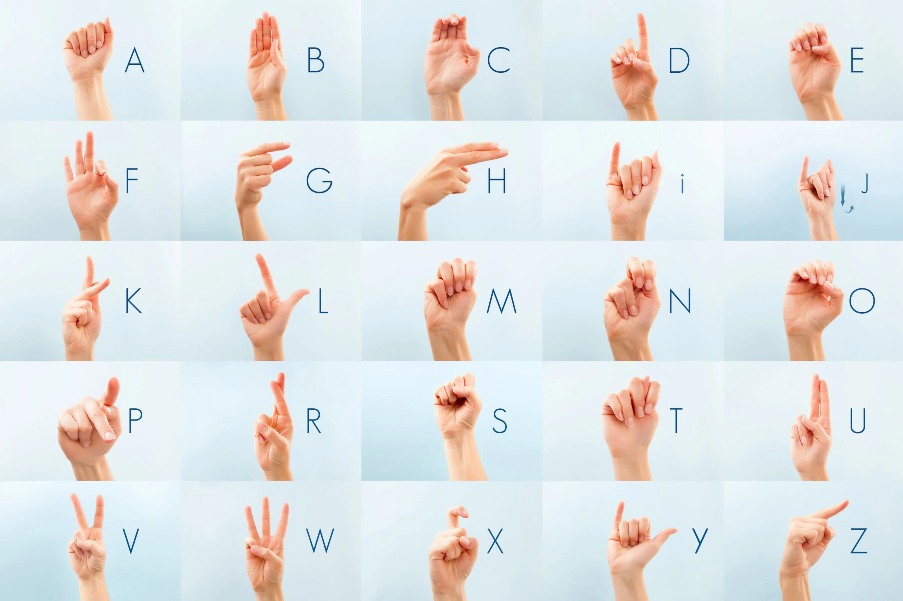

### Inleveropdracht : werken met posedata

# Opdracht 1

Je hebt zelf een creatieve applicatie bedacht waarbij een algoritme kan leren van posedata. Zie voor de exacte opdrachtomschrijving en inlevermethode de cursushandleiding.

   

### Live zetten

Voor de lessen en inleveropdrachten kan je jouw project (frontend en training/datacollectie) lokaal draaien op je eigen computer. Als je je frontend applicatie live online wil zetten kan je dit doen op je HR studenthosting, github pages, codesandbox, etc.

   

## Links

Code snippets en links voor werken met AI in Javascript

- [MediaPipe](https://mediapipe-studio.webapps.google.com/home)
- [Lees de webcam](./snippets/camera.md)

   

## React

Je kan MediaPipe en KNN toepassen in een React project

- [MediaPipe](./snippets/react.md)
- [KNN](./snippets/reactknn.md)

   

## Inspiratie

|  |  |
|--|--|
|  Music player besturen met gestures | Emotie herkennen om Spotify playlist aan te passen | 
|  Bodypose gebruiken om te controleren of je wel beleefd genoeg buigt | App om Yoga poses te oefenen | 
|  [KPOP dance dance revolution](https://www.youtube.com/watch?v=X-mX5PhYYRQ) | Human tetris | 
|  Game waarbij je Naruto Chakra's moet inzetten | App om gebarentaal te leren | 

 

- Expert level: gebruik de [javascript machine learning](https://github.com/HR-CMGT/Javascript-Machine-Learning) reading list om meer ideeën en inspiratie op te doen.

