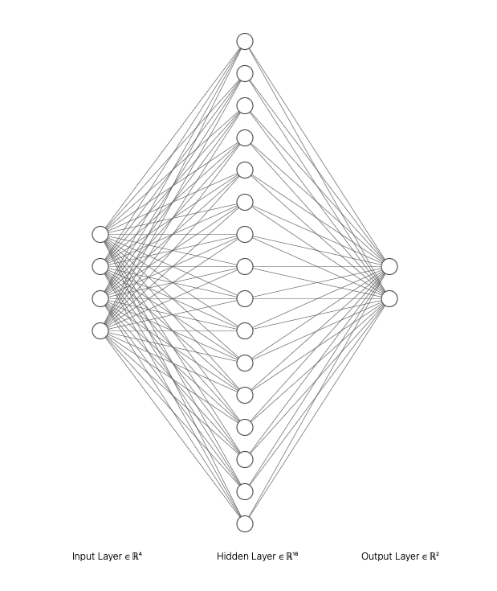
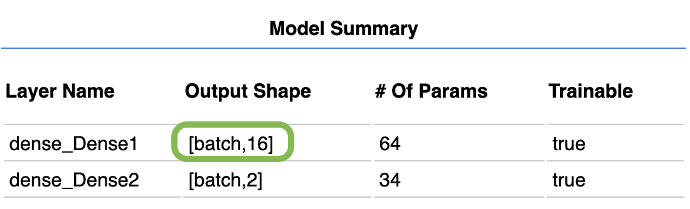
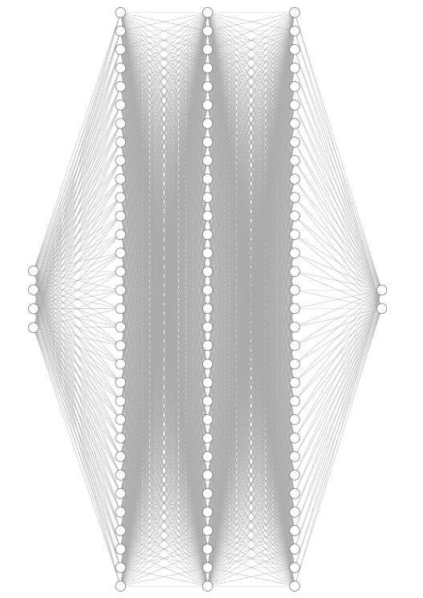
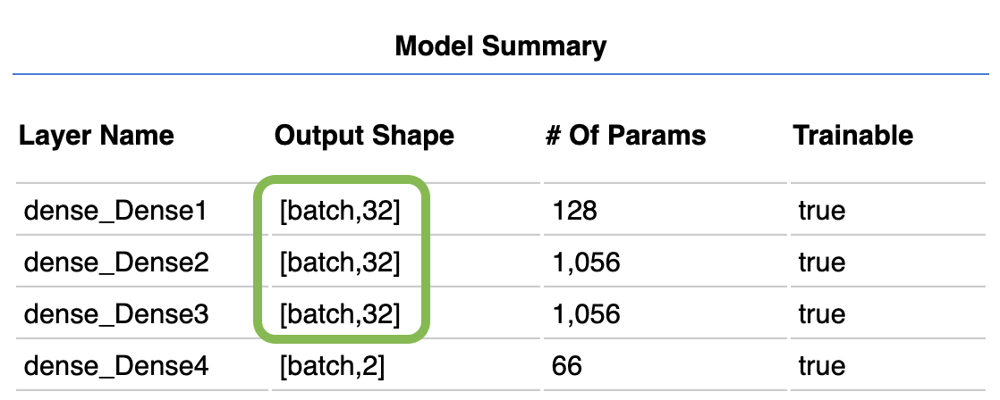

# Hidden Layers in ML5

De standaard instelling in ML5 is dat er één hidden layer is met 16 neurons. In deze afbeelding zie je dat er 4 inputs zijn en 2 outputs.



```javascript
const options = { 
    task: 'classification', 
    debug: true   
}
nn = ml5.neuralNetwork(options)
```

Dit kan je ook zien in het debug venster.




<br>
<br>
<br>

## Layers toevoegen

Een neural network kan effectiever worden met een afgestemde configuratie van hidden layers. De juiste afstemming kan je vinden door te testen! Let op dat de configuratie voor classification en regression er iets anders uit ziet.

<br>

### Classification

In dit voorbeeld maken we 3 hidden layers die elk 32 neurons hebben.



In code ziet dit er als volgt uit. De laatste layer is de output layer. ML5 bedenkt zelf hoeveel output neurons er nodig zijn, gebaseerd op je data. De input layer hoef je helemaal niet mee te geven.

```javascript
const options = { 
    task: 'classification', 
    debug: true,
    layers: [
        {
            type: 'dense',
            units: 32,
            activation: 'relu',
        }, {
            type: 'dense',
            units: 32,
            activation: 'relu',
        }, {
            type: 'dense',
            units: 32,
            activation: 'relu',
        },
        {
            type: 'dense',
            activation: 'softmax',
        },
    ]
}
nn = ml5.neuralNetwork(options)
```
In de model summary kan je zien of je instellingen goed zijn gegaan: 



<br>
<br>
<br>

### Learning rate

Je kan testen met batch size en learning rate om te zien of je een betere accuracy krijgt.

```javascript
const options = { 
    task: 'classification', 
    debug: true   ,
    learningRate: 0.2,
}
nn = ml5.neuralNetwork(options)
```

```js
const trainingOptions = {
  epochs: 32,
  batchSize: 12
}
nn.train(trainingOptions, finishedTraining);
```
<br>
<br>
<br>

### Regression

Regression betekent het voorspellen van een *getal* in plaats van een *klasse*. Bijvoorbeeld: de prijs van een huis, of het energieverbruik van een auto. Je kan bij het aanmaken van een neural network aangeven dat de task `regression` moet zijn.

In dit voorbeeld maken we extra hidden layers aan voor een regression task:

```javascript
const options = { 
    task: 'regression', 
    debug: true,
    layers: [
        {
            type: 'dense',
            units: 32,
            activation: 'relu',
        }, {
            type: 'dense',
            units: 16,
            activation: 'relu',
        },
        {
            type: 'dense',
            activation: 'linear',     
        },
    ]
}
nn = ml5.neuralNetwork(options)
```
Het toevoegen van data voor regression ziet er als volgt uit. In dit voorbeeld worden twee eigenschappen van een auto (gewicht en horsepower) gelinkt aan het energieverbruik (miles per gallon):

```js
// [weight, horsepower], miles per gallon
nn.addData([1000,120], 10)
nn.addData([1200,140], 12)
```

<br>
<br>
<br>

## Links

- [Custom layers in ML5](https://learn.ml5js.org/#/reference/neural-network?id=defining-custom-layers)
- [SVG Generator](https://alexlenail.me/NN-SVG/)
